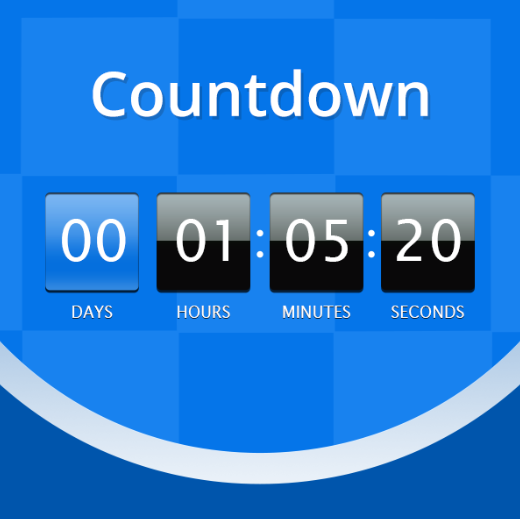

# Countdown Timer    &nbsp; 

> The Countdown Timer JavaScript project is a simple and interactive web application that allows users to set a specific date and time in the future and see the countdown until that moment. It's a useful tool for creating anticipation for upcoming events or deadlines.

## Features

- Set a custom date and time for the countdown.
- Visual representation of the remaining time in days, hours, minutes, and seconds.
- Option to display a personalized message for the event.
- Responsive design, suitable for various devices and screen sizes.
## Installation
To use the Countdown Timer project locally, follow these steps:

- Clone the repository:
git clone https://github.com/Sachin001s/countdown-timer.git
cd countdown-timer
## Files
The project consists of the following files:

- index.html: This file contains the HTML structure of the countdown timer web page. It includes the necessary elements for user input, displaying the countdown, and the target date selection.

- custom.css: The custom.css file contains the custom styling for the countdown timer. It is used to enhance the visual appearance of the web page and ensure a user-friendly experience.

- app.js: The app.js file contains the JavaScript code responsible for handling the countdown functionality. It calculates the time remaining, updates the display, and triggers any relevant actions when the countdown reaches zero.

## Usage
- View the countdown:
The application will display the remaining time in days, hours, minutes, and seconds until the specified date and time.
## Contributing
Contributions are welcome! If you find any issues or want to improve the project, feel free to create a pull request. Make sure to follow the existing code style and add tests for new functionalities.

If you encounter any bugs, please open an issue describing the problem, the expected behavior, and steps to reproduce it.
## License

The Countdown Timer project is open-source and available under the [MIT](https://choosealicense.com/licenses/mit/) License. You can use, modify, and distribute the code for personal and commercial purposes. However, please give appropriate credit to the original authors by linking back to the repository.

